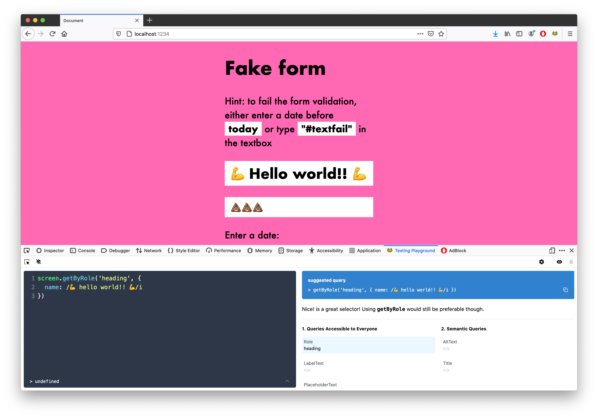

# Testing library code-along

---

This repo is to follow along with this great codealong:

- [Original codebase](https://github.com/nicolechung/testing-library-codealong)
- [Event](https://www.meetup.com/torontojs/events/278340348/)

Below is the original README

---



# Installation

```
npm install
```

# dev mode

```
npm start
```

# working tests

Working tests are in src/finished

# Testing Playground

[Testing Playground website](https://testing-playground.com/)

[Chrome extension](https://chrome.google.com/webstore/detail/testing-playground/hejbmebodbijjdhflfknehhcgaklhano?hl=en)

[Firefox extension](https://addons.mozilla.org/en-CA/firefox/addon/testing-playground/)

# Resources

[Javascript Testing Best Practices](https://github.com/goldbergyoni/javascript-testing-best-practices)

[Jest cheatsheet](https://devhints.io/jest)

[Jest DOM](https://github.com/testing-library/jest-dom)
